# 🚀 Portfolio CMS: Nuxt 3 & Laravel 11

<div align="center">


</div>
<p align="center">
<strong>A professional, high-performance content management system for developers.</strong>
</p>

## ✨ Features

### Frontend (Nuxt.js)
- 🎨 Modern, responsive UI with Tailwind CSS
- 📱 Mobile-first design
- 🚀 Fast page loads with SSR
- 🔍 SEO optimized
- 📝 Markdown support for blog posts
- 🖼️ Image upload and management
- 🎯 Dynamic project filtering

### Admin Dashboard
- 🔐 Secure authentication with Laravel Sanctum
- 📊 Manage projects (CRUD operations)
- 📝 Manage blog posts (CRUD operations)
- 🏷️ Tag and category management
- 📸 Image upload with drag & drop
- 🔄 Real-time form validation
- 📱 Responsive admin interface

### Backend (Laravel)
- 🛡️ API authentication with Sanctum
- 📁 File upload handling
- 🗄️ PostgreSQL database
- 🔄 RESTful API endpoints
- ✅ Request validation
- 🚀 Performance optimized

## 🛠️ Tech Stack

### Frontend
- [Nuxt.js 3](https://nuxt.com/) - Vue.js Framework
- [Tailwind CSS](https://tailwindcss.com/) - Styling
- [Nuxt Icon](https://nuxt.com/modules/icon) - Icon components
- [Nuxt Sanctum](https://github.com/partyworks/nuxt-sanctum) - Authentication

### Backend
- [Laravel 11](https://laravel.com/) - PHP Framework
- [Laravel Sanctum](https://laravel.com/docs/11.x/sanctum) - API Authentication
- [PostgreSQL](https://www.postgresql.org/) - Database
- [Flysystem](https://flysystem.thephpleague.com/) - File storage

## 📋 Prerequisites

- Node.js (v18 or higher)
- PHP (v8.2 or higher)
- Composer
- PostgreSQL (v14 or higher)
- Nginx/Apache (for production)

## 🚀 Installation

### 1. Clone the repository

```bash
https://github.com/meachsenbroseth/portfolio.git
cd portfolio-cms```

### 2. Backend Setup (Laravel)
```bash
# Navigate to backend directory
cd backend

# Install PHP dependencies
composer install

# Copy environment file
cp .env.example .env

# Generate application key
php artisan key:generate

# Configure database in .env file
# DB_CONNECTION=pgsql
# DB_HOST=127.0.0.1
# DB_PORT=5432
# DB_DATABASE=portfolio
# DB_USERNAME=postgres
# DB_PASSWORD=yourpassword

# Run migrations
php artisan migrate

# Seed database with admin user
php artisan db:seed --class=AdminUserSeeder

# Create storage link
php artisan storage:link

# Start Laravel development server
php artisan serve
```

### 3. Frontend Setup (Nuxt.js)
```bash
# Navigate to frontend directory (from project root)
cd frontend

# Install dependencies
npm install

# Copy environment file
cp .env.example .env

# Update API URL in .env
# NUXT_PUBLIC_API_BASE=http://localhost:8000

# Start development server
npm run dev
```

### 4. Access the Application
```bash
Frontend: http://localhost:3000

Admin Dashboard: http://localhost:3000/admin/login

Backend API: http://localhost:8000/api

Default admin credentials:

Email: admin@seth.dev

Password: password
```

## 📸 Screenshots
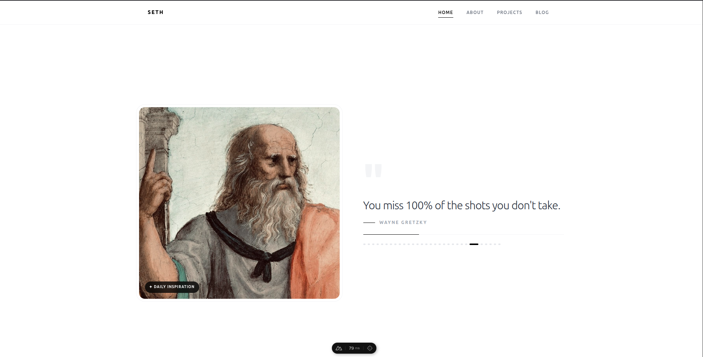
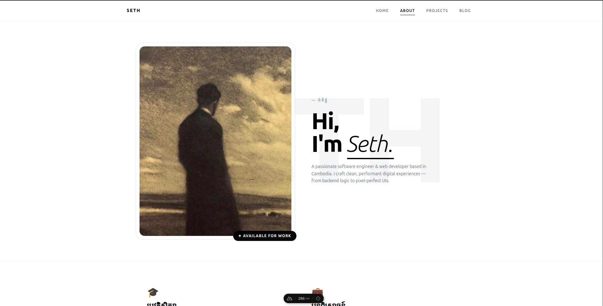
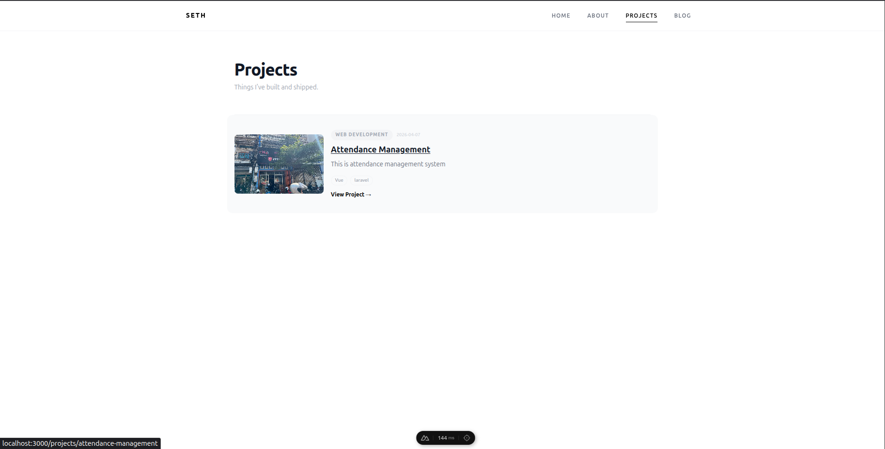
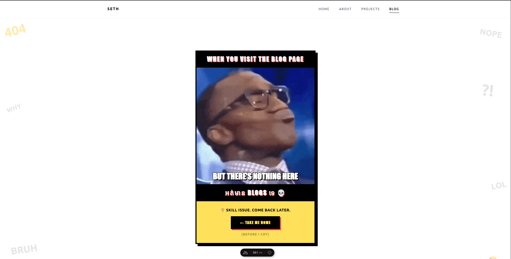
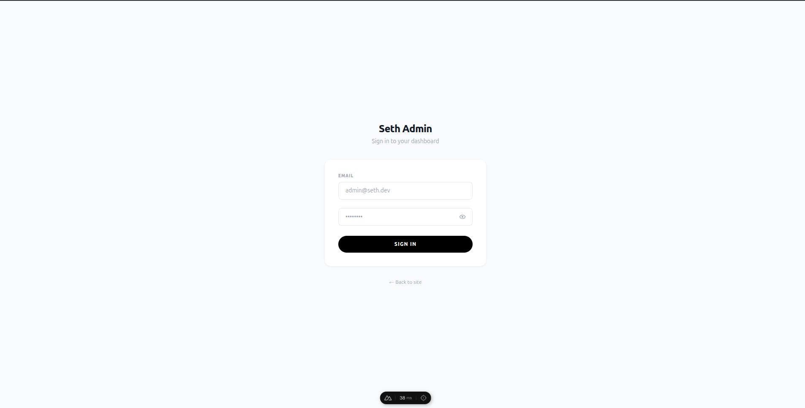
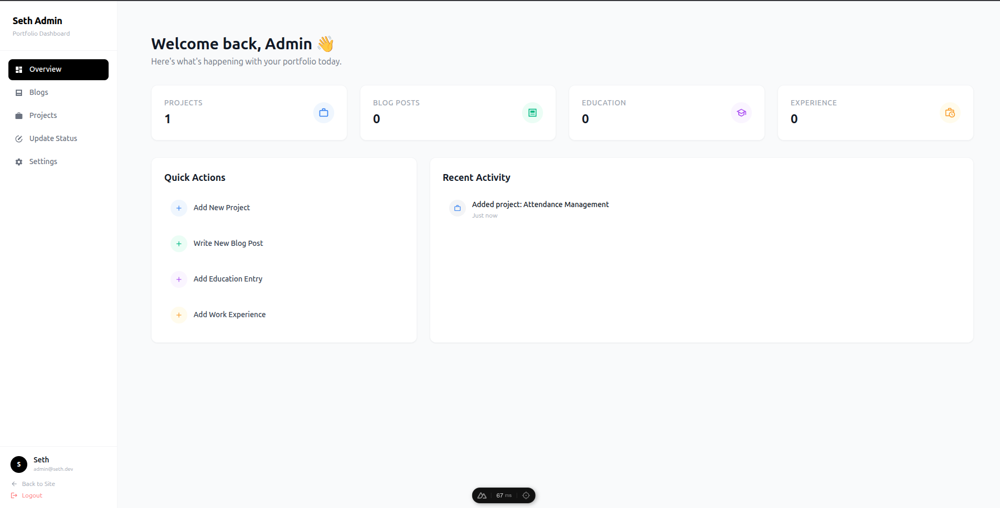
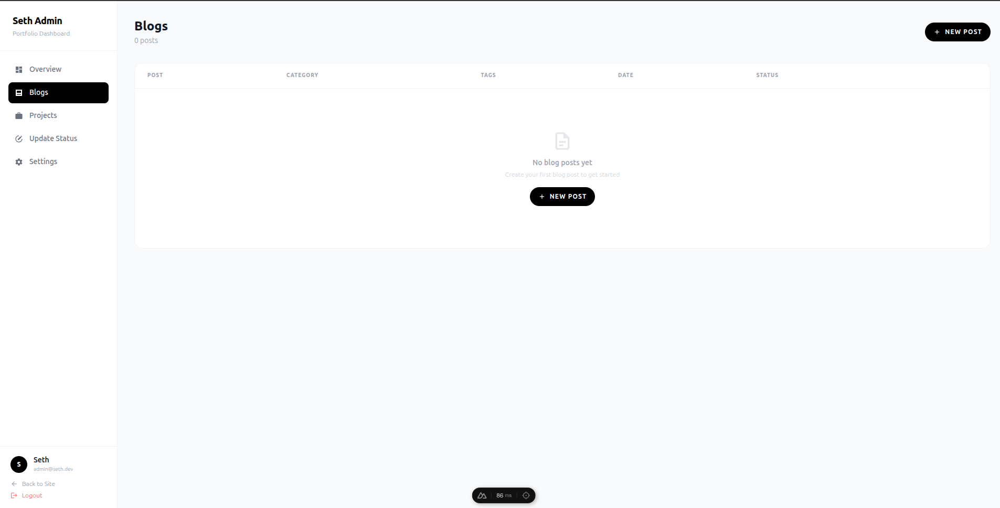
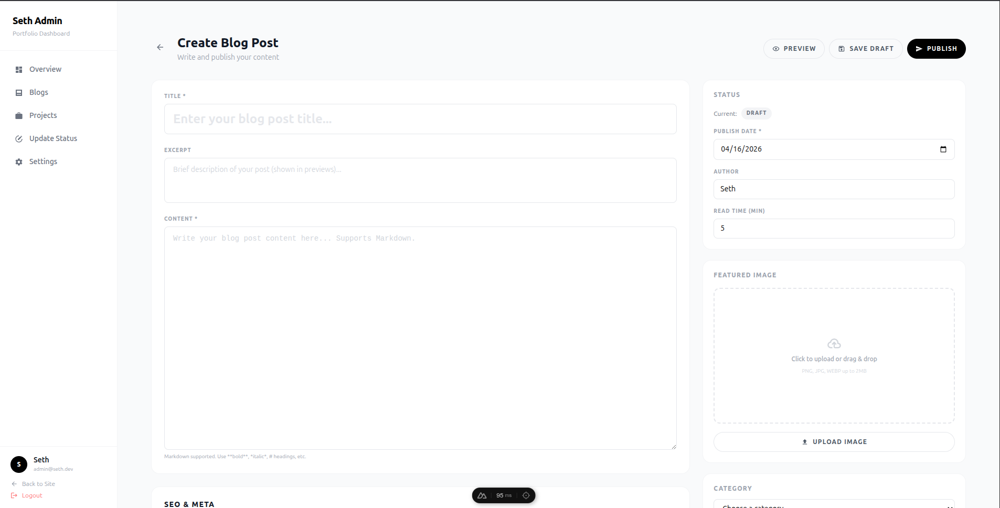
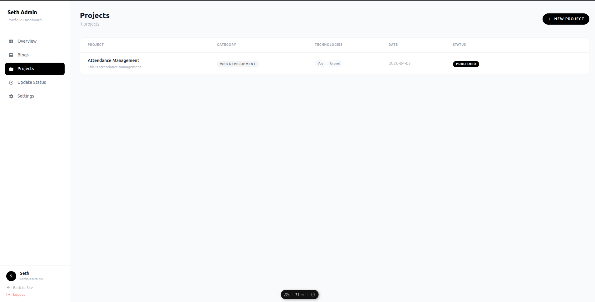
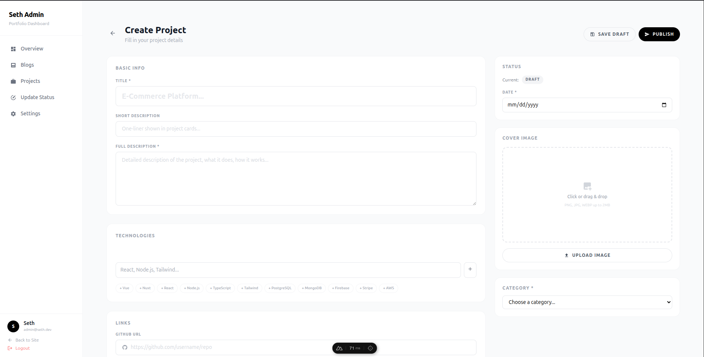
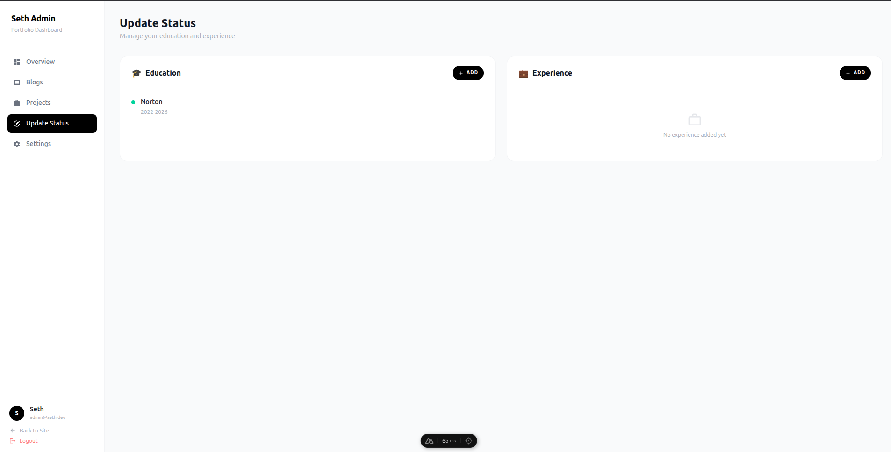
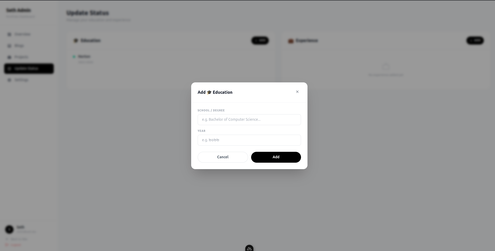
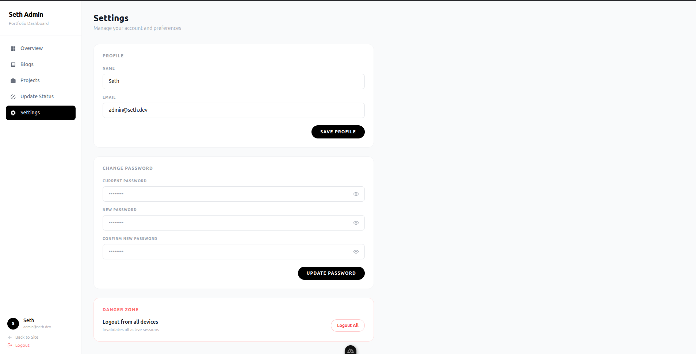
